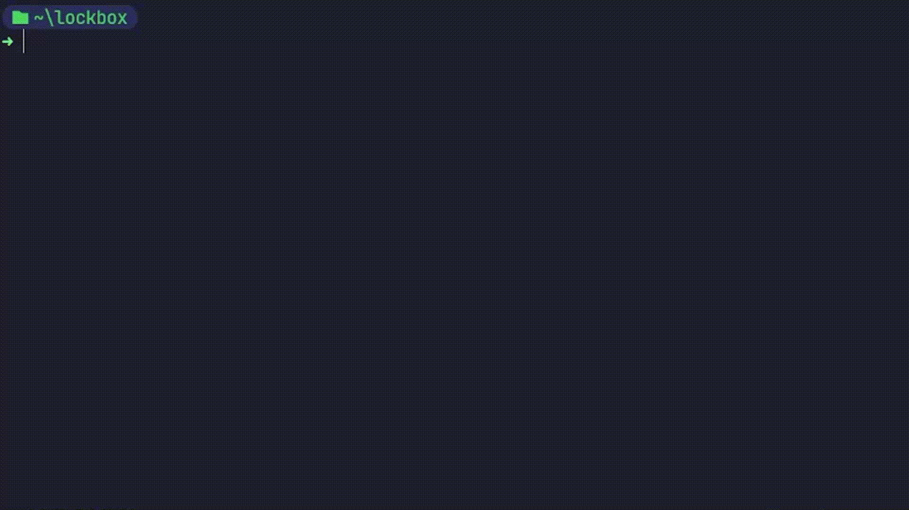
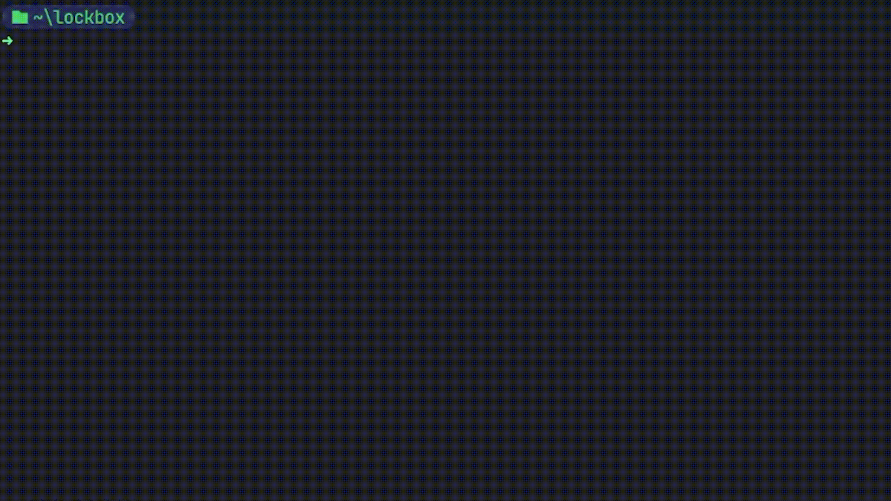
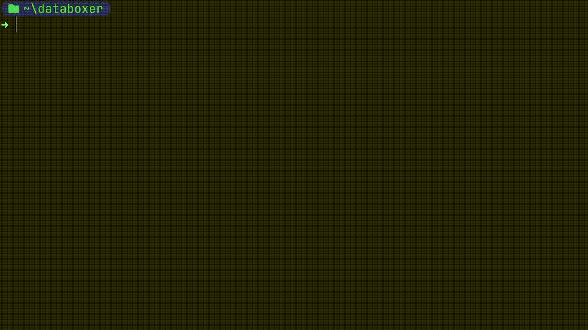

<div align="center">
    
</div>

<h1 align="center">Databoxer</h1>

> A data encryption program, which focuses on speed, safety and user-friendliness


*The project is still very work-in-progress and the mentioned features could very well change during development*

## 💡 About

Databoxer aims to be a lightweight cross-platform solution for file encryption

Unlike its competitors, Databoxer is aimed at making file encryption easy and accessible by focusing on user-friendliness
and simplicity, while also being efficient and safe. **It is not a drop-in replacement** for already long-existing
encryption tools, such as *Bitlocker*, but instead more of an alternative (*could be a subject to change*).

It is aimed at both average and more advanced users. Possible use cases can range from simple local data protection 
and access restriction to wireless data transfer and removable drive safety insurance. It's up to the user to decide
how to use the program, which is one of the Databoxer's key principles: to **be flexible and efficient**.

Databoxer operates based on the **ChaCha20** encryption algorithm in combination with the **Poly1305** universal hash
function to perform its encryption operations. It proved to be much more safe and fast than the most popular **AES**
algorithm used in many other similar programs. The files are encrypted using a randomly generated 32-byte *encryption
key* and per-file 12-byte *nonce*, which ensures ciphertext's uniqueness across different files.

## ⭐ Features

### 👤 Profile system

One of the key features of Databoxer is its **profile management system**. The user of the application can create
different profiles in order to store keys and manage file. Each profile has a unique encryption key which is later
used to encrypt/decrypt files and can be protected by user-defined password.

The profile system is planned to have more features in the future, such as encrypted file tracking (e.g. showing
how many files are currently encrypted with a given profile). Databoxer is also planned to have support to native
toolchains, such as *GnuPG* and *Kleopatra* for UNIX-like systems and *CryptoAPI (CNG)* for Windows in order to
ensure safer key storage.

### 📦 "Boxfile" file format

The encrypted files are "boxed" into a `boxfile` and stored in that way on the drive. A "boxfile" is a custom file
format which uses different techniques in order to ensure safety of the data, verify its content integrity and embed
additional information about the file. It is a way of obfuscating the stored data combined with giving the program
its unique features.

A `boxfile` consists of a *header*, *body* and *checksum*. 

- **Header** contains all the publicly available information about the file: version of the boxfile version used, length of
random padding and per-file randomly generated `nonce`, which is user for encryption processes.

- **Body** of the `boxfile` is made up from two things: the actual original file data and randomly generated padding. The
original data consists of original file name, extension, edit and access times, and the actual file contents. Padding
is a randomly generated stream of bytes (from sizes 4-255) which acts as an obfuscation technique during encryption,
as it combined with file data to make it harder to access original information and mislead the bad actor.

- **Checksum** is generated from the header and body content. It is a unique hash which represents the contents of the
pre-encrypted file data. During the decryption process file contents are hashed again and compared with the original
checksum to verify file data integrity.

## 🕹️ Usage

Currently, the CLI is implemented and can be used for all major operations, but it is planned to have both *CLI* and *GUI*
modes to appeal to a wider range of audience. 

The complete list of commands can be viewed with `databoxer --help`. Below are shown just the most common commands.


### Encrypting files

<div>
    
</div>

```bash
databoxer box <PATH>...
```

Multiple paths can be supplied for multi-file encryption, as well as directories (with optional recursive feature `-R`)

Output files will be encrypted and formatted into a custom `.box` file type with a random UUID as a name. User also
can specify the output location for each file with a `-o` flag

### Decrypting files

<div>
    
</div>

```bash
databoxer unbox <PATH>...
```

Functions similarly to encryption: support for multiple paths and directories. The original file name can be supplied
instead of a UUID to easily identify files

The input files have to have a `.box` file type. During decryption the program will restore original file name and
extension

### Configuring profiles

<div>
    
</div>

```bash
databoxer profile <ACTION> <NAME>
```

A new profile can be created with the `profile new` command. Each profile should have a name and password, which is
asked every time a profile-related feature is used by the user (e.g. encryption, as it requires profile's encryption
key).

Other profile manipulation actions include `select` which profile to use, `delete` to delete one and `list` to list
all other existing profiles.

### Manipulating encryption keys

<div>
    
</div>

```bash
databoxer key <ACTION>
```

The `key` subcommand is used to control the profile's stored encryption key. It can be outputted it in a formatted hex
string using the `key get` command. Use the `-b` flag to output it as an array of bytes.

A new key can be created with the `key new` command, generating a fresh encryption key and overwriting the old one. A
key can also be set from the outside (using a hex string) using the `key set <KEY>` command. The key has to be a 32-byte
key to be accepted (refer to `key get` command's output for how the key should look to be valid).

## 🧰 Development

As stated previously this project is in very active development. The current implementation of many things might
completely change by the time it is fully released.

### Feature plan

*These plans could change during future development*

- [x] User profile system
- [x] Multiple profiles/keys support
- [ ] Support for custom user config (using `config.toml`)
- [ ] File data compression
- [ ] Improved profile storage (SQLite?)
- [ ] Batch file encryption (`boxfile` archive)
- [ ] Multiple encryption algorithm support
- [ ] Remote key storage support (Google Drive, etc)
- [ ] OS-native toolchain support (GnuPG, Kleopatra, CryptoAPI, etc.)
- [ ] GUI interface

### Contribution

Any kind of contribution is very welcomed! The codebase is well-documented and actively maintained, so it would not
be too hard to get started with it.
